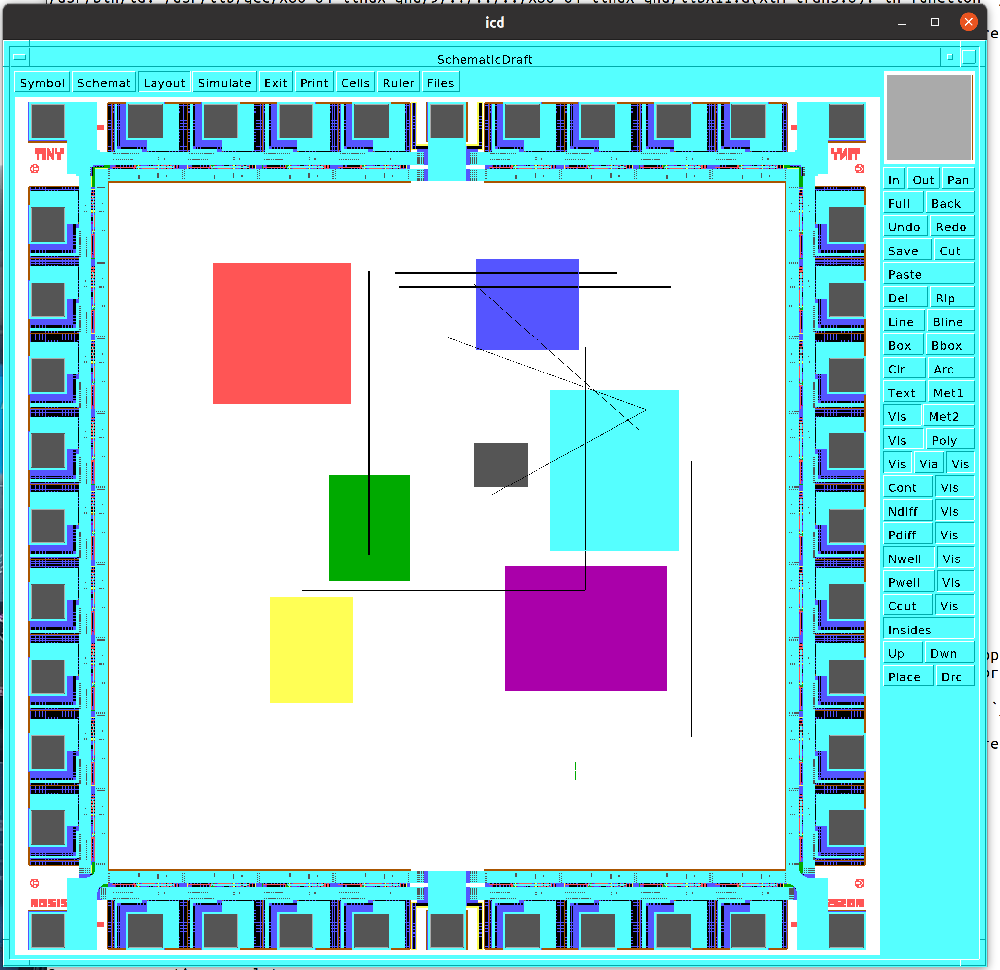

# Electronic design suite

This repo is a series of programs I wrote for electronic design. It is mostly 
oriented towards integrated circuit design. At the time it was written, it was
oriented towards the MOSIS brokered silicon service, which still exists at
mosis2.com.

The directories and projects are:

icd

This is a graphical design suite for IC layout design. It was designed around
CIF or Caltech Intermediate form, a polygon database form for ICs. It was
created and tested against sample CIF files, and is a fairly complete graphical
editor for same.

It was converted to run on the Petit-Ami graphical tool kit. At the present time
it is incomplete. The idea is it would run as a graphic front end to the simulator
below.

cktass

This is a fairly extensive program suite around the creation of IC designs using
text based descriptions with PMOS and NMOS transistors as the basic element of
design. It features a complete assembly language for transitor based netlists,
with macro processing capabilities. It has both a digital and an analong 
simulator. It has many utilties for constructing and manipulating netlists.

cif

Contains programs to manipulate cif format, as well as design examples.

